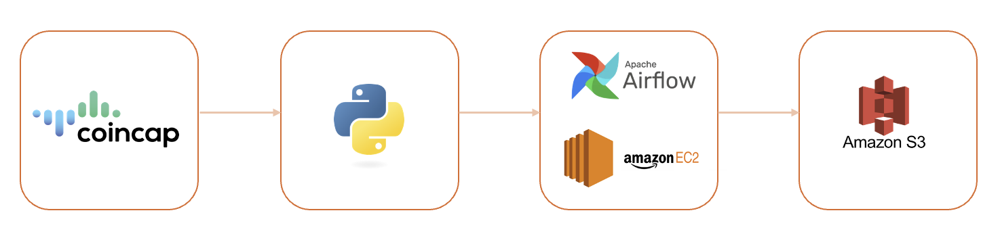
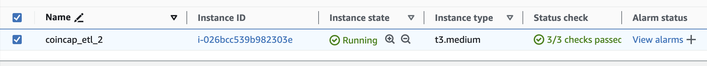
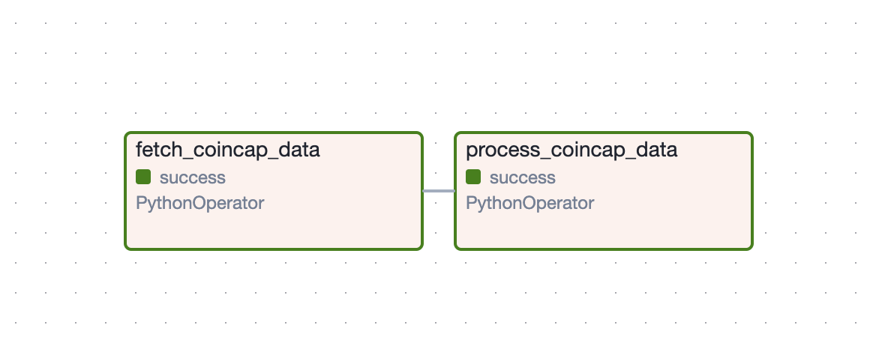
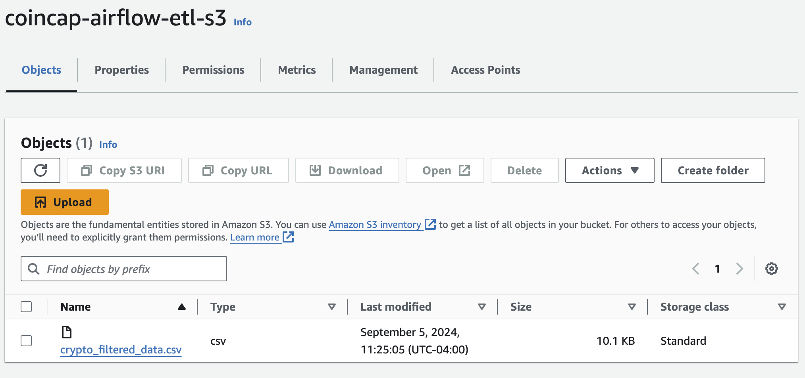

# Daily Crypto Market Data Pipeline

## Project Overview
This project involves developing a fully automated data pipeline to retrieve cryptocurrency market data from the CoinCap API, process it, and store the results in a CSV format. The pipeline is orchestrated using Apache Airflow, runs on an Amazon EC2 instance, and stores the final output in an AWS S3 bucket. This project demonstrates my proficiency in cloud-based data engineering, particularly in managing and optimizing data workflows using Airflow and AWS services.

## Objectives
- Automate the retrieval of cryptocurrency market data in JSON format.
- Process data to retrive relevant fields and store the data in a structured CSV format.
- Leverage cloud services (AWS EC2 and S3) to ensure scalability and reliability of the pipeline.
- Showcase expertise in Airflow and cloud computing, as well as an interest in cryptocurrency and blockchain technologies.

## Tools & Technologies Used
- **CoinCap API:** To fetch real-time cryptocurrency market data.
- **Apache Airflow:** For orchestrating and automating the data pipeline.
- **Amazon EC2:** To host the Airflow instance and run the pipeline.
- **Amazon S3:** To store the processed data as a CSV file.
- **Python:** For data processing tasks within the pipeline.

## Project Workflow
- **Data Retrieval:** The pipeline initiates with an Airflow DAG that triggers a Python script to fetch cryptocurrency data from the CoinCap API. 

- **Data Processing:** The fetched data is processed and transformed into a structured format (CSV) suitable for storage and analysis.

- **Data Storage:** The processed CSV file is then uploaded to an AWS S3 bucket for long-term storage and future access.

All related files are in the [script](./scripts) folder.

## Diagram: Airflow Pipeline Workflow

## Implementation Details
EC2 Setup: A t2.micro instance with Linux OS was provisioned on AWS to host Apache Airflow. The instance was configured with the necessary dependencies and security groups to allow for secure operations.

Airflow DAG: The Directed Acyclic Graph (DAG) in Airflow is scheduled to run daily, triggering the data retrieval process. The DAG consists of the following tasks:

- Task 1: Fetch data in JSON format from CoinCap API .

- Task 2: Process the JSON file and extract relevant fields such as id, rank, symbol, name, supply, maxSupply, priceUsd, changePercent24Hr, explorer and store in a structured CSV format.

S3 Storage: The final CSV files are stored in an S3 bucket, organized by date for easy retrieval and analysis.

## Screenshots
1. EC2 Instance Configuration

2. Airflow DAG

3. S3 Bucket with CSV Files

## Conclusion
This project provided a hands-on experience with setting up and managing a cloud-based data pipeline, enhancing my skills in data engineering. The use of Apache Airflow for workflow automation and AWS services for scalable infrastructure demonstrates practical knowledge in these technologies. The project also reflects my interest in cryptocurrency and blockchain technology, areas I am keen to explore further in future endeavors.

## Credits
Thanks to DarshilParmar Youtube channel for sharing his knowledge!
Libraries: Python Pandas, Logging, Requests, JSON
